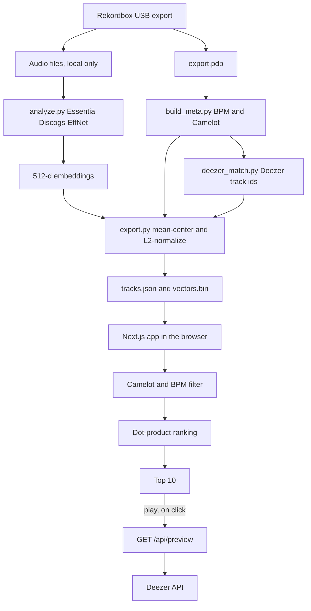

# NextTrack

NextTrack helps a DJ choose the next track. Matching musical key and tempo still leaves hundreds of candidates. This project ranks those candidates by how the records actually sound, using embeddings computed once from a private Rekordbox library and compared in the browser.

## Problem

Harmonic mixing is necessary and not sufficient. In a library of about 3,600 tracks, a typical track still has about 620 others that agree on Camelot key and BPM (including half-time and double-time). DJs then pick from memory: which of those 620 has the right timbre, drums, and mood. NextTrack does that last step with audio embeddings, without putting the music online.

## Approach

Audio never leaves the machine that owns it. A Python pipeline reads a Rekordbox USB export, embeds each track, and writes two files. The website loads those files and ranks candidates locally.



Each track becomes one 512-dimensional Discogs-EffNet embedding. The export mean-centers the matrix and L2-normalizes every row, so similarity is a dot product. The browser decodes the float16 matrix once, drops tracks that fail the Camelot intent or the BPM tolerance, and sorts what remains.

The only server call is optional. If a track has a Deezer id, pressing play asks `/api/preview` for a short preview URL. The app does not host, proxy, or store audio.

## Tech stack

| Piece | Choice |
| --- | --- |
| Embeddings | Essentia TensorFlow, Discogs-EffNet |
| Library metadata | Rekordbox `export.pdb` via `rekordbox-pdb`, plus Mutagen in the private Streamlit tool |
| Preview ids | Deezer search API, matched offline |
| Web app | Next.js 16, React 19, TypeScript, Tailwind CSS 4, App Router |
| Tests | Vitest, for Camelot neighbors, BPM compatibility, and ranking |
| Hosting | Railway. Set the root directory to `web`. Build `npm run build`, start `npm start`. No Docker image. |

## Run the web app

```bash
cd web
npm install
npm test
npm run dev
```

Open [http://localhost:3000](http://localhost:3000). The page loads `web/public/data/tracks.json` and `web/public/data/vectors.bin` in the browser.

Production, including on Railway:

```bash
cd web
npm install
npm run build
npm start
```

`next start` listens on `PORT`.

## Run the pipeline

Scripts live in `pipeline/` and expect to be run from that directory. They read and write local files. Do not commit models, audio, `vectors.jsonl`, `metadata.json`, or `deezer.json`.

```bash
cd pipeline
python3 -m venv .venv
source .venv/bin/activate
pip install -r requirements.txt
```

1. Put the Essentia Discogs-EffNet track-embedding model at `pipeline/models/discogs_track_embeddings-effnet-bs64-1.pb`. The model is not in this repo.
2. Point a Rekordbox USB export at the analyzer. It reads audio under `<usb>/Contents` and appends `vectors.jsonl`:

   ```bash
   python analyze.py /path/to/rekordbox-usb
   ```

3. `build_meta.py` reads `export.pdb` and writes `metadata.json` (artist, title, genre, BPM, Camelot). The database path is the `PDB` constant at the top of that script.
4. Match Deezer track ids. This calls the Deezer search API and writes `deezer.json`:

   ```bash
   python deezer_match.py
   ```

5. Build the files the website loads:

   ```bash
   python export.py
   cp tracks.json vectors.bin ../web/public/data/
   ```

`similar.py` is a small command-line probe over `vectors.jsonl`. `app.py` is a private Streamlit tool for listening to local files and rating neighbors. It is not the public app, and it expects audio on disk.

```bash
streamlit run app.py
```

## Demo

Live demo: _add the Railway URL here._

Screenshot: _add `docs/screenshot.png` after the first deploy._

## Limitations and next steps

- Deezer coverage is about 74%. Tracks without an id have no preview button.
- Deezer previews are often the start of the track, not a mixable section.
- The embedding measures timbre and style. It does not know the room, the crowd, or where a track sits in a set.
- Next step: score the ranker against 305 real DJ sets from Rekordbox history, and see how often a track that was actually played next lands in the top 10.

## Credits and licenses

- Embeddings use Essentia and the Discogs-EffNet model from the Music Technology Group at Universitat Pompeu Fabra. The Essentia models are [CC BY-NC-SA 4.0](https://creativecommons.org/licenses/by-nc-sa/4.0/). That license is non-commercial: keep NextTrack non-commercial unless the model terms change.
- Short previews and track links come from the [Deezer API](https://developers.deezer.com/). The site does not redistribute audio.
- Camelot key and BPM come from the owner's Rekordbox export. The music itself is not part of this repository.
- `rekordbox-pdb` is [fragmede/rekordbox-pdb](https://github.com/fragmede/rekordbox-pdb).
